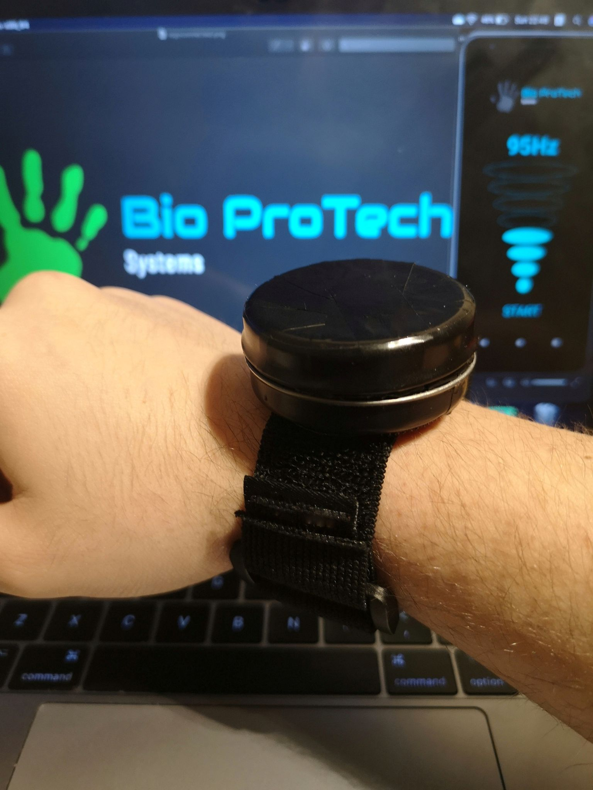
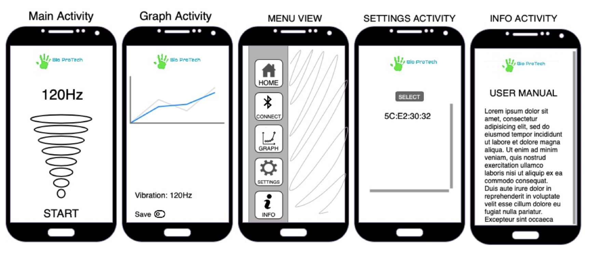

# Bio Protech 
## Smart Wearable Device for Reduction of Parkinson’s Disease Hand-Tremor

Project Supervisor: Professor Greg South

Project Manager: Bruno Ribeiro

Bio Protech Team:  Juan Carlos, Leopoldo Medeiros & Rodrigo Aguiar

Parkinson's disease is a neurodegenerative disorder that affects over 10 million people worldwide (Health Unlocked, 2017). People diagnosed with Parkinson's Disease can experience tremors, muscular rigidity and slowness of movement. Tremor is the most common symptom and external agents like stress and anxiety can make it worse, which may cause complications to complete simple day-to-day tasks.

Therefore Bio Protech proposes the development of a smart wearable device for reduction of the hand-tremors based on medical evidence that by applying vibration to the wrist may result in a reduction of the involuntary tremor. The device imitates the shape of a wristwatch and the vibration is supplied by motors placed around the wrist. The users will be given the possibility to regulate the frequency according to their needs using a mobile application connected via Bluetooth, which is also developed by Bio Protech team.

## Park Med and Bio Protech App

